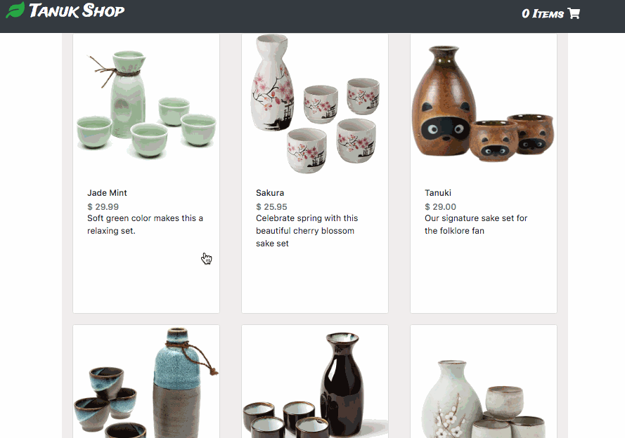

# Tanuk Shop

A demonstration of an e-commerce site utilizing a Full Stack Content Management System

## Live Demo
Tanuk Shop can be found here: [https://tanuk.acanlas.dev](https://tanuk.acanlas.dev)

## Technologies Used
- React.js
- HTML5
- CSS 3
- BootStrap 4
- Express.js
- Node.js
- PostgreSQL
- Webpack 4
- AWS EC2

## Features
- User can view listing of products
- User can view product details
- User can add item to shopping cart
- User can remove shopping cart items
- User can view total price of all cart items
- User can update quantity of products in cart
- User can place order*

* This is not an actual store. Please do not enter personal information

## Preview


## Development
#### System Requirements
- Node.js 10 or higher
- NPM 6 or higher
- PostgreSQL 6 or higher

#### Getting Started
1. Clone the repository

```
git clone https://github.com/a-canlas/tanuk-shop.git
```

2. Install all dependencies with NPM

```
npm install
```

3. Import the example database

```
npm run db:import
```

4. Start the database

```
sudo service postgresql start
```

5. Start the project

```
npm run dev
```

6. Go to localhost:3000 in your browser
